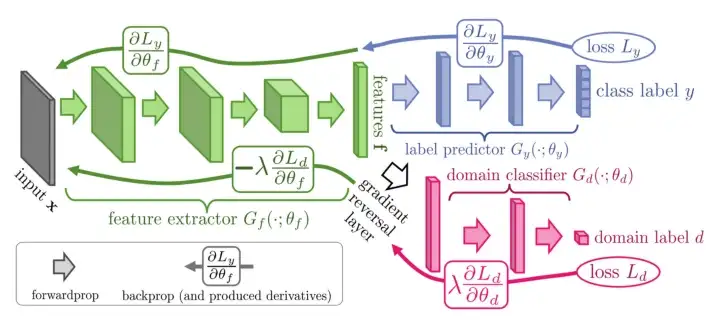

# Unsupervised Domain Adaptation by Backpropagation
Authors: Yaroslav Ganin, Victor Lempitsky
arXiv: https://arxiv.org/abs/1409.7495

Unoffical PyTorch implementation.

## Architecture
<p align="center">
  
</p>

## Setup
### Install dependencies
```shell
pip install -r requirements.txt
```
### Data
Data for MNIST and SVHN datasets will be automatically downloaded.
For other datasets, download data and place into the appropriate directory (`_DATA` by default, change in config file).

### Training
Select which config to use from `dann/config.py`.
```
python train.py
```

## Experiments
### SVHN -> MNIST
| Methods                    | MNIST -> MNIST-M | SYN -> SVHN   | SVHN -> MNIST | SYN -> GTSRB  |
| Train on source only       | 52.25            | 86.74         | 54.90         | 79.00         |
| SA (Fernando et al., 2013) | 56.90 (4.1%)     | 86.44 (−5.5%) | 59.32 (9.9%)  | 81.65 (12.7%) |
| DANN                       | 76.66 (52.9%)    | 91.09 (79.7%) | 73.85 (42.6%) | 88.65 (46.4%) |
| Train on target            | 95.96            | 92.20         | 99.42         | 99.80         |

## Citation
```
@InProceedings{pmlr-v37-ganin15,
  title = 	 {Unsupervised Domain Adaptation by Backpropagation},
  author = 	 {Ganin, Yaroslav and Lempitsky, Victor},
  booktitle = 	 {Proceedings of the 32nd International Conference on Machine Learning},
  pages = 	 {1180--1189},
  year = 	 {2015},
  editor = 	 {Bach, Francis and Blei, David},
  volume = 	 {37},
  series = 	 {Proceedings of Machine Learning Research},
  address = 	 {Lille, France},
  month = 	 {07--09 Jul},
  publisher =    {PMLR},
  pdf = 	 {<a href="http://proceedings.mlr.press/v37/ganin15.pdf" title="Linkify Plus Plus" class="linkifyplus" rel="noopener">http://proceedings.mlr.press/v37/ganin15.pdf</a>},
  url = 	 {<a href="https://proceedings.mlr.press/v37/ganin15.html" title="Linkify Plus Plus" class="linkifyplus" rel="noopener">https://proceedings.mlr.press/v37/ganin15.html</a>},
  abstract = 	 {Top-performing deep architectures are trained on massive amounts of labeled data. In the absence of labeled data for a certain task, domain adaptation often provides an attractive option given that labeled data of similar nature but from a different domain (e.g. synthetic images) are available. Here, we propose a new approach to domain adaptation in deep architectures that can be trained on large amount of labeled data from the source domain and large amount of unlabeled data from the target domain (no labeled target-domain data is necessary). As the training progresses, the approach promotes the emergence of "deep" features that are (i) discriminative for the main learning task on the source domain and (ii) invariant with respect to the shift between the domains. We show that this adaptation behaviour can be achieved in almost any feed-forward model by augmenting it with few standard layers and a simple new gradient reversal layer. The resulting augmented architecture can be trained using standard backpropagation. Overall, the approach can be implemented with little effort using any of the deep-learning packages. The method performs very well in a series of image classification experiments, achieving adaptation effect in the presence of big domain shifts and outperforming previous state-of-the-art on Office datasets.}
}
```

## References
[paper](https://arxiv.org/abs/1409.7495)
